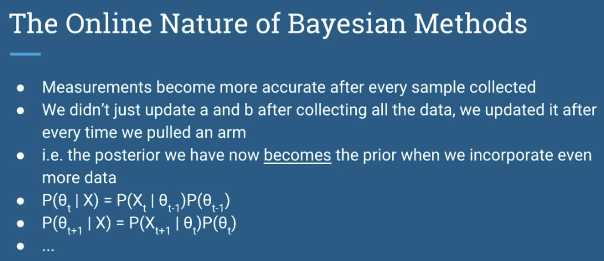

- We update everytime we pull an arm
- Posterior we have now becomes the prior of the next

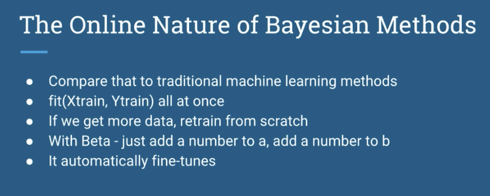
- Compare this against traditional machine learning methods
    - train again from scratch

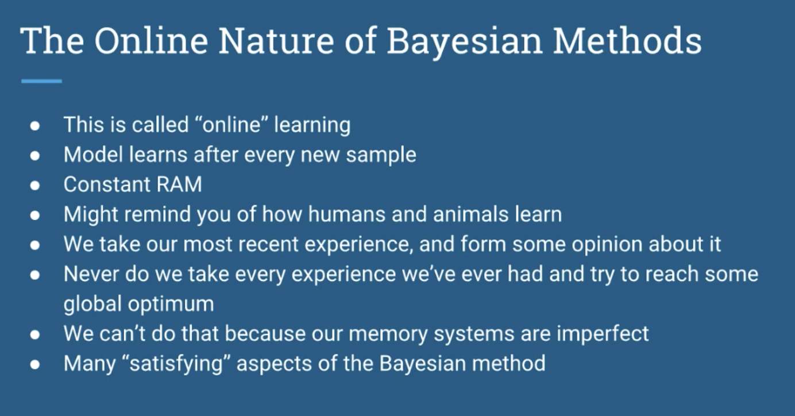

# Pvalue thresholds

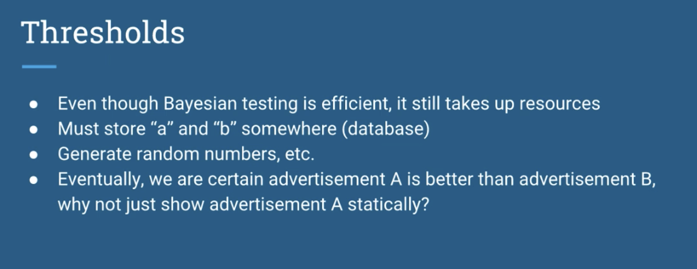

- must store a and b somewhere

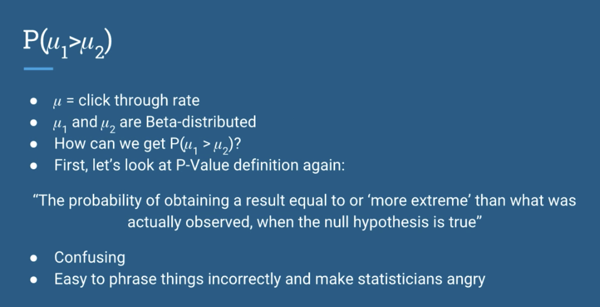

- mu1 and mu2 are beta distributed

## Recall definition of pvalues

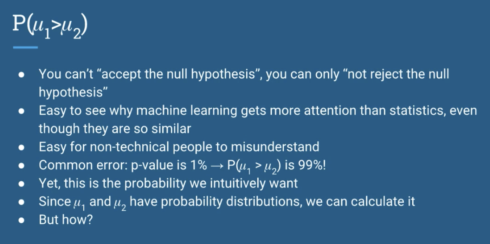
- You can't accept the null hypothesis
    - you can only not 'reject the null hypothesis'

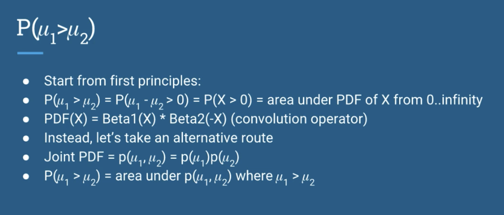

- joint pdf
    - multiplication of the two
    - since they are independent

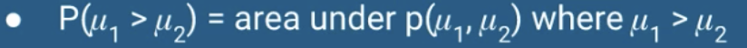
- find the area under the curve where mu1 > mu2

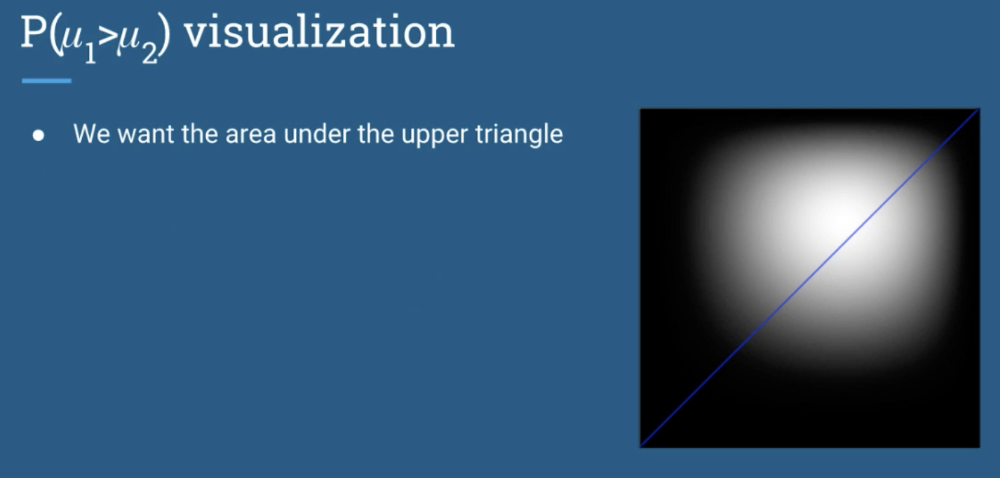

- we want the area on the upper triangle

# Another option
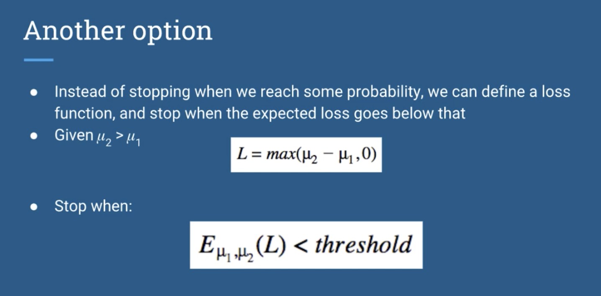

- Use a loss function
    - quit when a threshold is found

# Convergence.py

- See how it converges to the best bandit

At 1000 samples

At 10 000 samples

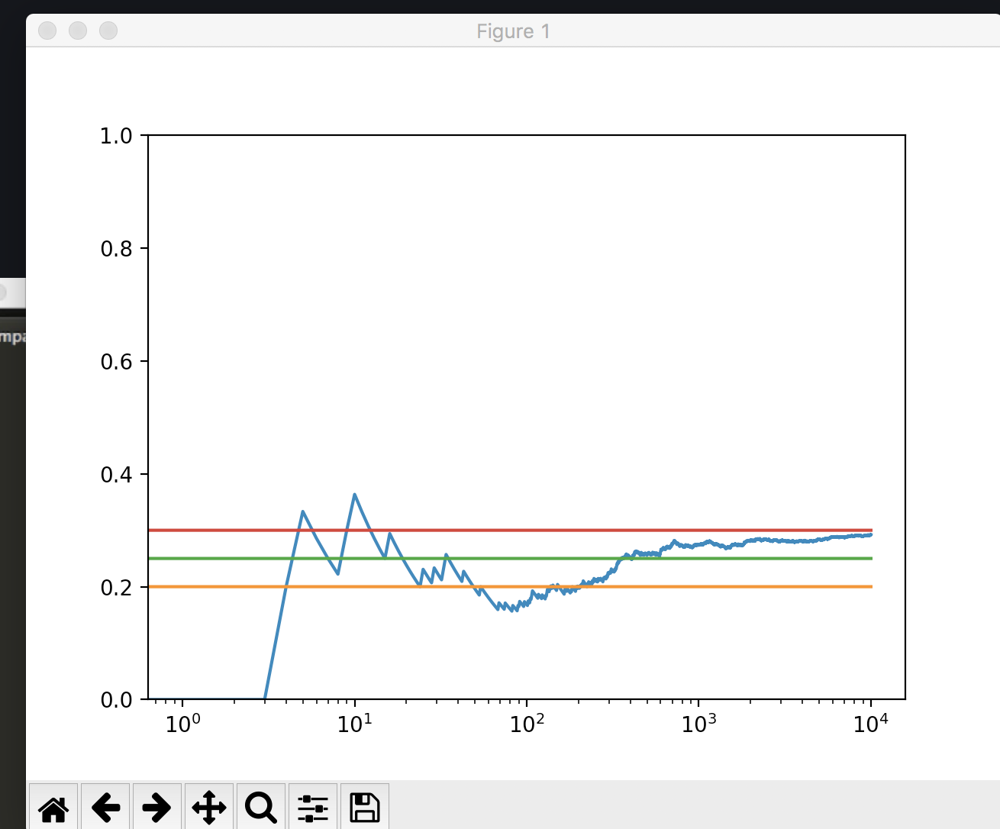